Git 在项目中发挥着重要作用，主要体现在团队协作开发和版本管理上，是开发者应该熟练掌握的技能。本文目的就是帮助初学者快速入门 Git 基本操作，团队协作开发上更流畅。

### 基本概念

理解 git 基本的工作区、暂存区、版本库，掌握 git 的基本操作就是事半功倍

#### 工作区

​	就是在电脑里能看到的目录

暂存区

​	一般存放在`.git`目录下的`index`文件中，所以暂存区有时也叫索引（`index`）

版本库

​	工作区下的隐藏目录`.git`，就是 git 的版本库，记录所有的分支、提交信息

### 创建新库

#### 初始化

在当前目录下创建仓库，生成 .git 目录

````bash
git init
````

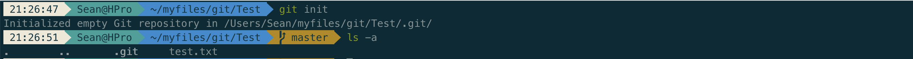

##### 撤销版本控制

删除工程的 .git 目录即可

```bash
rm -rf .git
```

### 提交修改

#### 1.查看仓库状态

该命令可经常使用，很多时候会给出下一步的一些建议，注意查看

```bash
git status
```

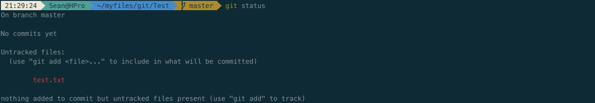

#### 2.添加文件

添加文件到暂存区

```bash
git add .
```

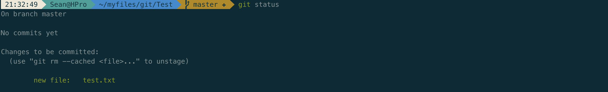

#### 3.提交

```bash
git commit -m "commit message"
```

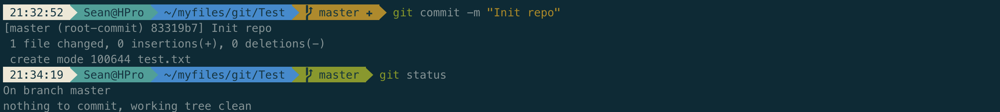

#### 4.追加提交

该命令会进入交互页面，可以在前一提交中追加文件，可用于改提交信息。如本文进入交互页面，将提交信息改为 'Init repository'

```bash
git commit --amend
```

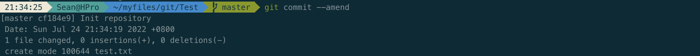

#### 5.回滚

回滚到某个 commit，会保留最新 commit 到该 commit 的修改内容。追加`--hard`撤销工作区的所有改动。reset 还有很多用法，需要在实践中去探索

```bash
git reset <commit_id>
```

#### 6.查看提交历史

查看历史

```bash
git log
```


查看最近 n 条历史。本文为测试进行了第二次提交，能够查看两次历史

```bash
git log -n
```

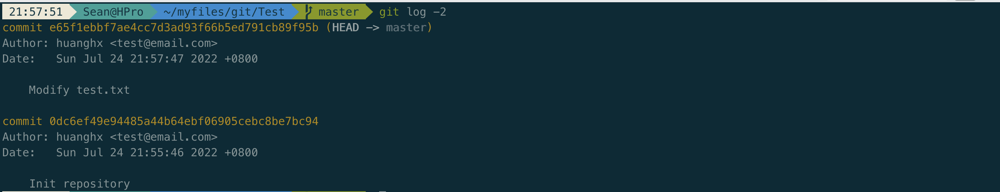

显示简短信息。有些时候我们不需要太详细的信息

```bash
git log --oneline
```

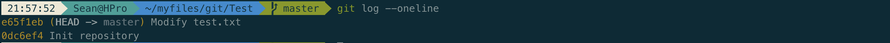

打印 git 树，查看不同分支的情况

```bash
git log --oneline --graph --decorate --all
```

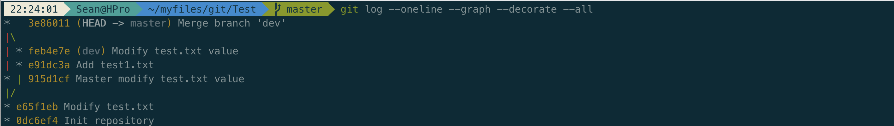

### 分支管理

#### 1.查看分支

```bash
git branch
```

#### 2.新建分支

新建分支并切换到对应分支

```bash
git checkout -b <branch_name>
```

该命令等同于

```bash
git branch <branch_name>
git checkout <branch_name>
```


#### 3.合并分支

实际情况下会经常遇到分支冲突，按照提示解决冲突即可

```bash
git merge <branch_name>
```

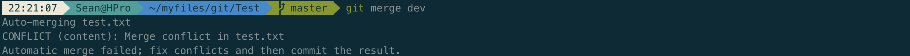

解决完冲突后重新提交，这时会多一个 merge 节点

```bash
git add .
git merge --continue
```


有时候只需要合入分支的某些提交，可以采用以下方式，注意该方式会生成新的 commit

```bash
git cherry-pick <commit_id>
```

### 标签管理

可以给关键提交打上标签，方便后续版本回滚之类的操作

#### 1.添加标签

当前节点打标签

```bash
git tag <tag_name>
```


也可以指定某个提交打标签

```bash
git tag <tag_name> <commit_id>
```

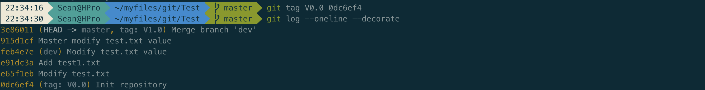

还可以通过 `-a` 添加标签描述信息，感兴趣可自行尝试

#### 2.删除标签

```bash
git tag -d <tag_name>
```

### 远程管理

#### 1.添加远程版本库

具体项目中，可同时关联多个远程库

```bash
git remote add <name> <origin>
```


#### 2.拉取远程代码并合并

```bash
git pull
```

#### 3.推送到远程并合并

```bash
git push
```

### 缓存管理

当本地有修改时，突然有拉取最新代码，或其他分支修改的时候，可将当前修改缓存起来

#### 1.保存

保存当前所有修改文件。当本地保存较多时最好加上`-m`描述信息

```bash
git stash -m 'stash message'
```


保存指定文件

```bash
git stash push -m "stash message" test.txt
```

#### 2.查看当前所有保存记录

```bash
git stash list
```


#### 3.查看保存记录具体修改

```bash
git stash show <stash_id>
```

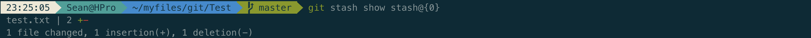

#### 4.恢复

将最新一条保存记录恢复到工作区，并且删除记录，追加`--index`可以同时恢复到工作区和暂存区

```bash
git stash pop
```

也可以指定恢复具体一条记录

```bash
git stash pop <stash_id>
```

还可以恢复并且保留记录

```bash
git stash apply
```

#### 5.删除记录

删除最新一条记录

```bash
git stash drop
```

删除指定记录

```bash
git stash drop <stash_id>
```

清空记录

```bash
git stash clear
```

### 小结

本文从创建新库、提交修改、分支管理、标签管理、远程管理、缓存管理等方面介绍了 git 的基本操作，在实际项目过程中也比较常用，是每个开发者应该熟练掌握的技能。当然，本文不可能包含所有 git 操作，还有很多较为复杂、实用的功能，需要开发者在项目中不断探索掌握。
