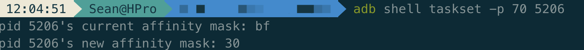
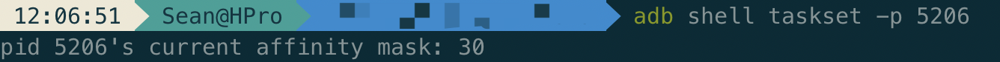
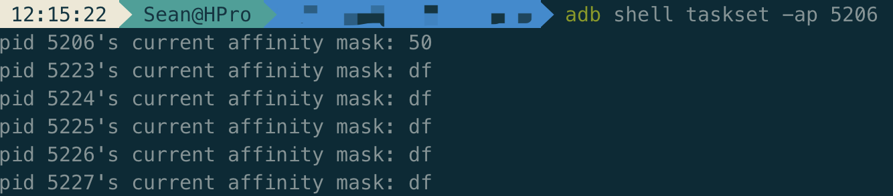

## 一、简介

高通骁龙采用 1+3+4 的设计，1 个 `Prime` 超大核、3 个 `Kryo Gold` 核心和 4 个 `Kryo Silver` 核心，其中 0-3 是 `Silver` 核心，4-6 是 `Gold` 核心，7 是 `Prime` 超大核。

## 二、CPU 掩码

2 位 16 进制，转 2 进制分别对应 8 个核心，对应位为 1 即绑定到该核

|            | CPU 序号和掩码对应关系 | 备注                                            |
| ---------- | :--------------------- | ----------------------------------------------- |
| CPU 序号   | 7  6  5  4  3  2  1  0 |                                                 |
| 默认掩码   | 1  1  1  1  1  1  1  1 |                                                 |
| 绑定超大核 | 1  0  0  0  0  0  0  0 | 可能无法绑定                                    |
| 绑定大核   | 0  1  1  1  0  0  0  0 | 掩码范围：0x10 - 0x70，可视具体情况绑定到指定核 |
| 绑定小核   | 0  0  0  0  1  1  1  1 | 掩码范围：0x01 - 0x0f，可视具体情况绑定到指定核 |

## 三、根据掩码绑核

以下两种方式都需要 root 权限

```bash
adb root
```

### (一) 方法一：taskset 命令

#### 1.进程或线程绑核命令

- 增加`-a`代表进程下的所有线程都设置

- cpu 掩码对应多个核心时，设置完成后的掩码可能是这几个核心的任意组合，并且会观察到这个值会不断变化
- 新起线程如果值不对需要重设
- 如偶现执行失败可重试

```bash
adb shell taskset -p <cpu_mask> <pid/tid>
adb shell taskset -ap <cpu_mask> <pid/tid>
```



#### 2.查询进程或线程绑核情况

- 增加`-a`不管传进程ID还是所属线程ID，都会出来进程所有线程的绑定信息

```bash
adb shell taskset -p <pid/tid>
adb shell taskset -ap <pid/tid>
```





#### 3.常用修改命令

- 绑定超大核

```bash
adb shell taskset -p 80 <pid>
```

- 绑定大核（绑三核，根据cpu mask 可指定具体核）

```bash
adb shell taskset -p 70 <pid>
```

- 绑定小核（绑四核，根据cpu mask 可指定具体核）

```bash
adb shell taskset -p f <pid>
```

- 恢复默认

```bash
adb shell taskset -p ff <pid>
```

### (二) 方法二：修改 `/dev/cpuset/top-app/cpus`

`/dev/cpuset/top-app/cpus` 默认值是 0-7，修改该值会让所有进程都只能使用指定核心，修改方法如下：

```bash
adb shell
cd /dev/cpuset/top-app
echo 4-6 > cpus
```

修改完成后使用 taskset 可查看是否符合预期

```bash
adb shell taskset -p <pid/tid>
```
